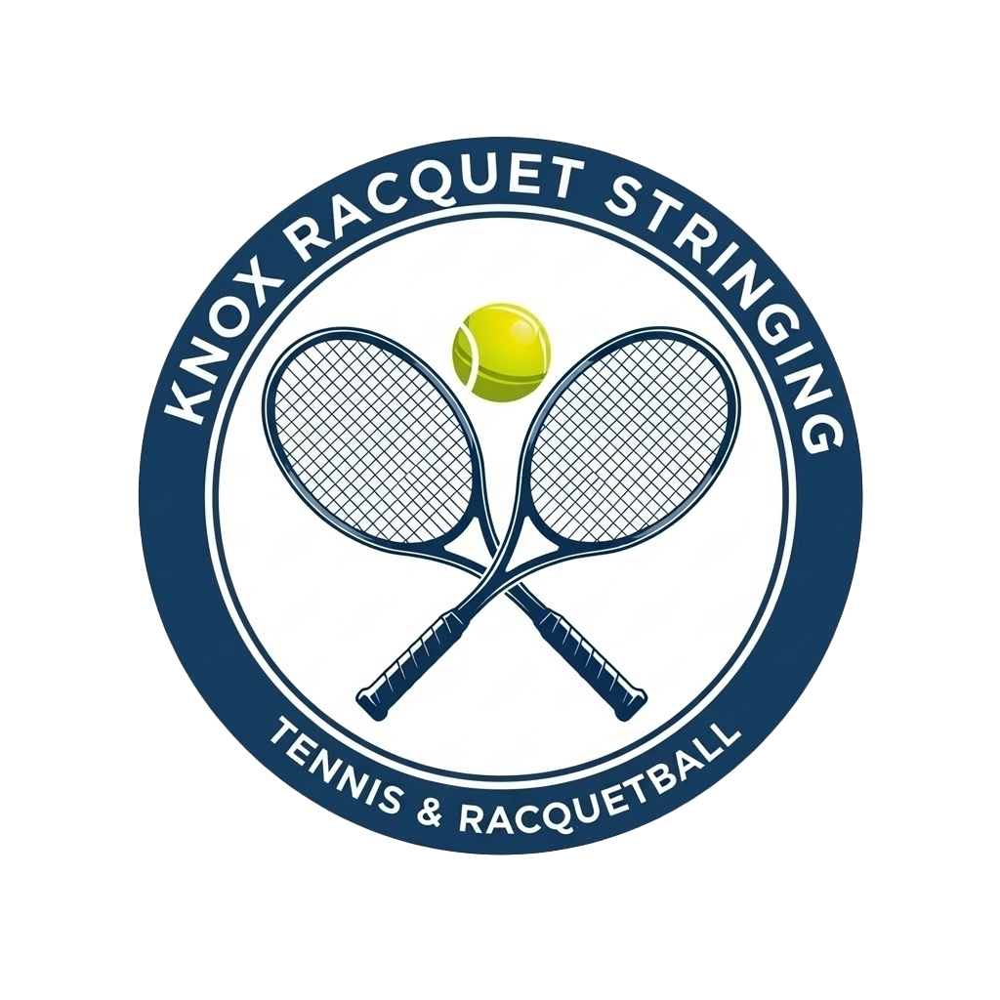

<div align="center">
 
  
  <h3>Knox Racquet Stringing</h3>

  Professional tennis and racquetball stringing in Waukee, Des Moines, and the greater central Iowa area.
  <br>
  <br>

  [![CI-Build][ci-badge]][ci-link]
  [![CodeQL-Build][codeql-badge]][codeql-link]
  [![License][license-badge]][license-link]
  <br>
  [![Release][release-badge]][release-link]
  [![Commits][commits-badge]][commits-link]
  [![Website][website-badge]][website-link]

</div>

## Overview

This is a static website for a professional racquet stringing business in central Iowa. The site is plain HTML, CSS, and JavaScript (no frameworks). Contact form submissions are handled by [Formspree][formspree-link]. There is no backend in this repo.

## Deploy

The site runs with **Docker Compose**:

- **website** — Nginx serves static files from `./html` (copy or mount the built site there, or point the volume at the repo and set `root` in `nginx.conf` accordingly).
- **tunnel** — Cloudflare Tunnel (`cloudflared`) exposes the service. Set `TUNNEL_TOKEN` in the environment (e.g. in a non-committed `.env` file).

Getting new code onto the server: On every push to `main`, [CI][ci-link] runs and then a deploy job runs on a self-hosted runner on the server. It executes `scripts/pull-deploy.sh`, which pulls from GitHub, runs `npm ci`/`npm install` and `npm run build`, then rsyncs into the Nginx docroot. The server must have Node.js installed.

To deploy by hand on the server:

```bash
bash ~/Docker/KnoxStringing/repo/scripts/pull-deploy.sh
```

[ci-link]:          https://github.com/bknox83/knoxstringing-website/actions/workflows/ci.yml
[codeql-link]:      https://github.com/bknox83/knoxstringing-website/actions/workflows/codeql.yml
[commits-link]:     https://github.com/bknox83/knoxstringing-website/commits/main
[formspree-link]:   https://formspree.io
[license-link]:     https://github.com/bknox83/knoxstringing-website/blob/main/LICENSE
[release-link]:     https://github.com/bknox83/knoxstringing-website/releases/latest
[website-link]:     https://knoxstringing.com

[ci-badge]:         https://img.shields.io/github/actions/workflow/status/bknox83/knoxstringing-website/ci.yml?branch=main&label=CI-Build&style=for-the-badge
[codeql-badge]:     https://img.shields.io/github/actions/workflow/status/bknox83/knoxstringing-website/codeql.yml?branch=main&label=CodeQL-Build&style=for-the-badge
[commits-badge]:    https://img.shields.io/github/commits-since/bknox83/knoxstringing-website/latest?style=for-the-badge
[license-badge]:    https://img.shields.io/github/license/bknox83/knoxstringing-website?style=for-the-badge&color=orange
[release-badge]:    https://img.shields.io/github/v/release/bknox83/knoxstringing-website?style=for-the-badge
[website-badge]:    https://img.shields.io/website?url=https%3A%2F%2Fknoxstringing.com&label=website&style=for-the-badge
